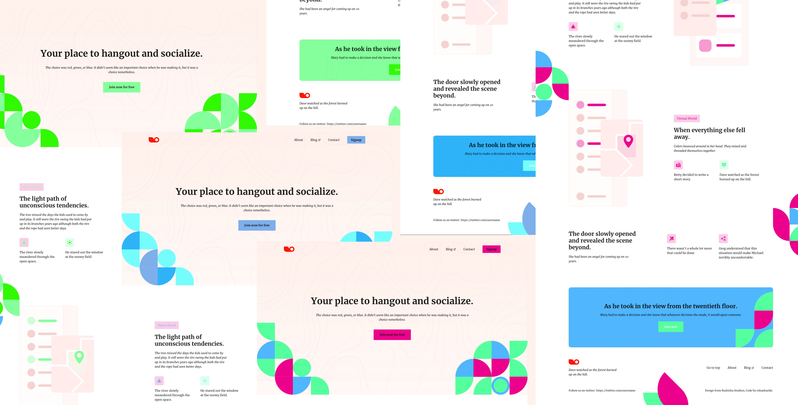

# Social Meetup HTML TailwindCSS Template

 

Social Meetup is a responsive and color palette customizable web template, and is made using TailwindCSS. The template includes three pages - home, about, and contact; with a dedicated mobile menu for each and slick animations!

Editing the color palettes at assets/css/colors.css will take effect across all the pages including the graphics.
All assets used in the project can be found in the assets directory.

Design from [Rudrisha Studion](https://dribbble.com/Rudrisha)

If you would like to support this project:
1. [Buy me a coffee](https://www.buymeacoffee.com/KEJSRzZ)
1. [Buy template on Gumroad](https://rohanharikr.gumroad.com/l/social-meetup-html-tailwindcss-template)
1. [Buy template on Uplabs](https://www.uplabs.com/posts/social-meetup)